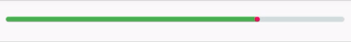
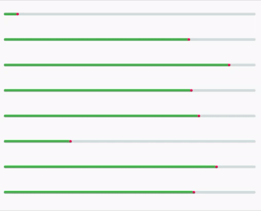
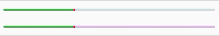
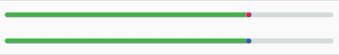

##   AnimatedProgressBar

<p>Animated determinate horizontal Progress Bar for Android.</p>

[](https://opensource.org/licenses/Apache-2.0)






## 💻 Installation
Root build.gradle:
``` groovy
allprojects {
    repositories {
        maven { url "https://jitpack.io" }
    }
}
```

Your app's build.gradle:
```groovy
dependencies {
  implementation 'com.github.mckrpk:AnimatedProgressBar:0.1.0'
}
```

Minimum required SDK version is 14.
## ❔ Usage

``` xml
<com.mckrpk.animatedprogressbar.AnimatedProgressBar
    android:id="@+id/animatedProgressBar"
    android:layout_width="match_parent"
    android:layout_height="wrap_content"
    android:layout_marginTop="8dp"
    app:animationDurationInMs="1600"
    app:animationStyle="wave"
    app:lineWidth="6dp"
    app:max="1000"
    app:progress="750"
    app:progressColor="@color/colorPrimary"
    app:progressTipColor="@color/colorAccent"
    app:progressTipEnabled="true"
    app:trackColor="@color/colorGray" />
```

or programmaticaly

``` kotlin
val progressBar = AnimatedProgressBar(this)
progressBar.setMax(100)
progressBar.setProgress(75)
progressBar.setTrackColor(Color.GRAY)
progressBar.setProgressColor(Color.GREEN)
progressBar.setProgressTipEnabled(true)
progressBar.setProgressTipColor(Color.RED)
progressBar.setAnimDuration(1200)
progressBar.setProgressStyle(AnimatedProgressBar.ProgressStyle.WAVE)
progressBar.setLineWidth(dpToPx(5, this).toInt())
```
## 🎨 Attributes

| name               | type              | default         | example |
|--------------------|-------------------|-----------------|---------|
| max                | Int               | 100             | 100     |
| progress           | Int               | 0               | 75      |
| style              | Enum: Line,  Wave | Line            |         |
| trackColor         | Int               | GREY            |         |
| progressColor      | Int               | Theme's primary |         |
| progressTipColor   | Int               | Theme's accent  |         |
| progressTipEnabled | Boolean           | true            |         |
| animDuration       | Int               | 1200ms          |         |
| lineWidth          | Int               | 4dp             |         |

## 📃 License

    Copyright 2019 Michał Karpiuk

    Licensed under the Apache License, Version 2.0 (the "License");
    you may not use this file except in compliance with the License.
    You may obtain a copy of the License at

       http://www.apache.org/licenses/LICENSE-2.0

    Unless required by applicable law or agreed to in writing, software
    distributed under the License is distributed on an "AS IS" BASIS,
    WITHOUT WARRANTIES OR CONDITIONS OF ANY KIND, either express or implied.
    See the License for the specific language governing permissions and
    limitations under the License.

**Please don't hesitate to star the library if you find it useful or interesting.** 😊
